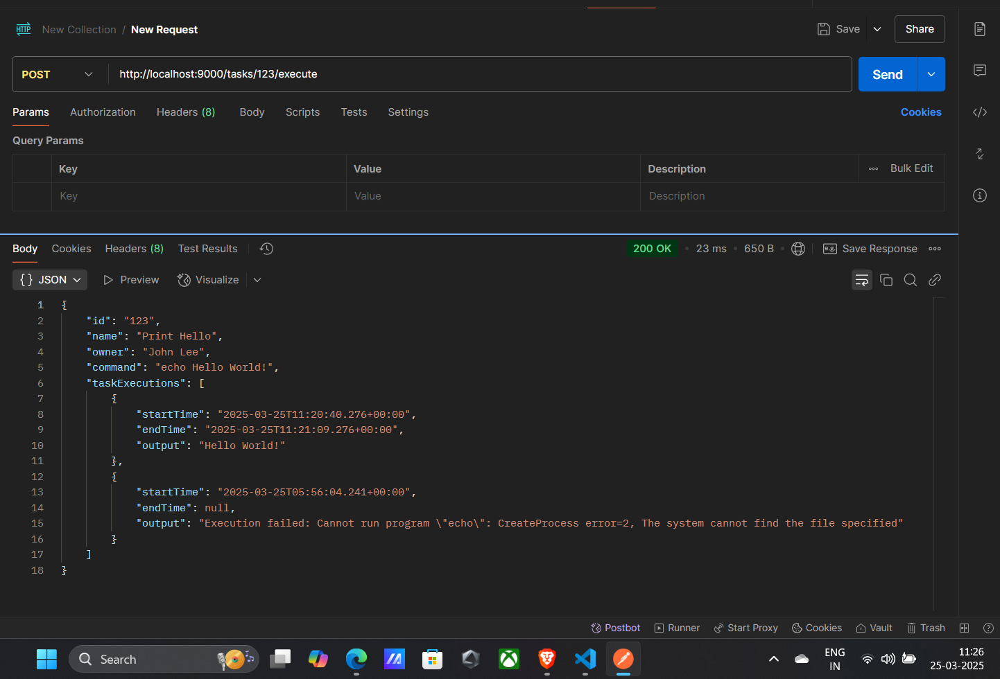

# Task Management Backend

## Overview
This is the backend service for the Task Management application. It provides RESTful APIs to manage tasks, execute commands, and store execution history.

## Features
- Create, read, update, and delete tasks
- Execute shell commands associated with tasks
- Store task execution history
- Search and filter tasks

## Tech Stack
- **Backend:** Spring Boot
- **Database:** MongoDB
- **Build Tool:** Maven
- **API Documentation:** Swagger (if enabled)

## Prerequisites
- Java 17 or later
- MongoDB installed and running
- Maven installed

## Setup & Installation

### Clone the repository
```sh
git clone https://github.com/NishanthIlango/Task-manager-backend.git
cd task-management-backend
```

### Configure MongoDB
Ensure MongoDB is running locally or update `application.properties` with your MongoDB connection details.

### Build & Run the Application
```sh
mvn clean install
mvn spring-boot:run
```

The server will start at `http://localhost:9000`.

## API Endpoints

### Task Management
| Method | Endpoint | Description |
|--------|---------|-------------|
| GET | `/tasks` | Retrieve all tasks |
| GET | `/tasks/{id}` | Retrieve a specific task by ID |
| POST | `/tasks` | Create a new task |
| PUT | `/tasks/{id}` | Update a task |
| DELETE | `/tasks/{id}` | Delete a task |

### Task Execution
| Method | Endpoint | Description |
|--------|---------|-------------|
| POST | `/tasks/{id}/execute` | Execute the task's command |

## Testing
Use Postman or any API testing tool to interact with the endpoints. Example request:
```json
{
  "name": "Print Hello",
  "owner": "John Doe",
  "command": "echo Hello World!"
}
```
- Task Creation: 
- Task Execution: 
- All Task Execution: 


